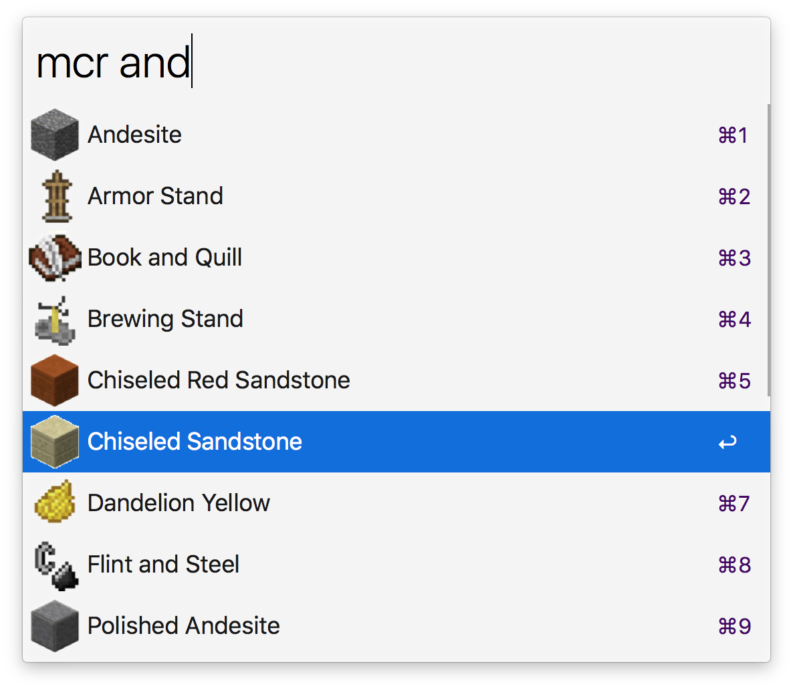

# alfred-mcr

> [Alfred 3](https://www.alfredapp.com) workflow to browse minecraft recipes using Quick Look.

## Install

``
$ npm install --global alfred-mcr
``

*Requires [Node.js](https://nodejs.org) 4+ and the Alfred [Powerpack](https://www.alfredapp.com/powerpack/).*

## Usage

In Alfred, type `mcr`, <kbd>Enter</kbd>, and the name of your block.

To view a recipe, press shift whilst the item is highlighted.  
You can also view the item in your default image viewer by selecting it.
